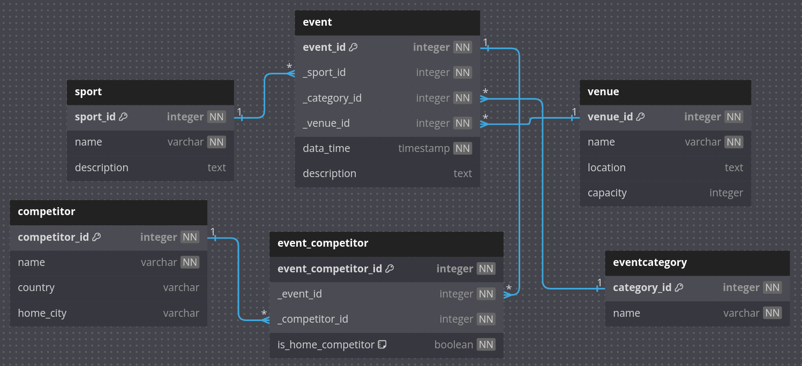

# Sports Calendar (BE) - Assignment

## Overview

The Sports Event Calendar is a web application developed as per the assignment provided by Sportradar. It allows users to view, add, and categorize sports events. The backend is built using Node.js and Express.js, with a MySQL relational database for data storage and management.

## Built Using

- **Node.js**: JavaScript runtime for backend development.
- **Express.js**: Lightweight web framework for building APIs and routing.
- **MySQL**: Relational database system for managing sports events data.
- **Sequelize**: ORM (Object-Relational Mapping) for database interaction.
- **Express Validator**: Middleware for validating user input.
- **Pug**: Template engine for frontend rendering.
- **CSS**: Styling for user-friendly and readable frontend.

## Installation

Clone the repository:
git clone https://github.com/your-repo/sports-calendar.git

Navigate to the project directory:
cd sports-calendar

Install dependencies:
npm install

Set up the .env file with database credentials and other configuration:
plaintext
Copy code
DB_HOST=localhost
DB_USER=root
DB_PASSWORD=sportradar
DB_NAME=sportscalendar_db

Start the application:
npm start

The application will run on http://localhost:3000.

# Task 1 – Database Modeling

## Implementation

The database schema was designed with the following entities (tables):

- **Sport**: Stores sports categories (e.g., Football, Ice Hockey).
- **Venue**: Includes venue details such as name, location, and capacity.
- **EventCategory**: Defines categories for events (e.g., League Match, Friendly).
- **Competitor**: Stores teams or participants for events.
- **Event**: Captures details of specific events, linking to Sport, Venue, and EventCategory.
- **EventCompetitor**: Establishes many-to-many relationships between Event and Competitor.

### Features

- **Normalization**: The schema follows the third normal form (3NF) for efficient data storage and management.
- **Additional Enhancements**: Venue details (location and capacity) and event descriptions were added to enhance the sports calendar's usability.

### Entity-Relationship Diagram (ERD)

The following ERD illustrates the database structure, including relationships between tables:

---

# Task 2 – Database Structure and Data

## Implementation

### Relational Database System

MySQL was used for this project.

### Tables Created

- `sport`
- `venue`
- `event_category`
- `competitor`
- `event`
- `event_competitor`

### Primary and Foreign Keys

- Each table has a primary key.
- Foreign keys connect `event` to `sport`, `venue`, and `event_category`.
- The `event_competitor` table establishes many-to-many relationships.

### Sample Data

The database was populated with sample data, including:

- **Events**:
  - "Sat., 18.07.2019, 18:30, Football, Salzburg vs. Sturm."
  - "Sun., 23.10.2019, 09:45, Ice Hockey, KAC vs. Capitals."
- **Sports**: Football, Ice Hockey, Basketball.
- **Venues**: National Stadium, Community Hall, Stadium A.

---

# Task 3 – Implementation

## Backend

### Features

#### Add New Event

- **API Endpoint**: `/api/events` (POST)
- Allows users to add events to the database.
- Includes validation for sport, venue, category, and date.
- **Known Issue**: Needs improved functionality for sport search within the modal.

#### Retrieve All Events

- **API Endpoint**: `/api/events` (GET)
- Retrieves all events, optionally filtered by date (e.g., `?date=YYYY-MM-DD`).

#### Retrieve Today’s Events

- **API Endpoint**: `/api/events/today` (GET)
- Retrieves events happening on the current date.

#### Retrieve Single Event

- **API Endpoint**: `/api/events/:id` (GET)
- Fetches a single event by its ID.

### Validation

All endpoints include validation using `express-validator`.

---

## Frontend

### Features

#### Page Layout

- **Navigation Bar**: Contains placeholder links (e.g., `Home`, `About Us`) and a search bar.
- **Date Navigation**: Users can navigate to previous or future dates using arrow buttons, with events updating dynamically.
- **Event List**: Displays event details (date, sport, teams, venue, and description) in card format.
- **Styling**: User interface styled with CSS for a modern and clean look.

#### Add New Event Modal

- A modal form allows users to add new events.
- **Known Issue**: Sport selection in the modal needs enhanced functionality for better usability.

#### Filter by Date or Sport

- Users can filter events by specific sports or dates.

#### Date Picker

- Allows users to pick a specific date and view events for that day.

---

## Conclusion

### Backend Status

- Fully functional, meeting the assignment requirements:
  - Adding new events.
  - Fetching events by date, ID, or today’s events.
- SQL queries are optimized, and no loops are used for queries.
- Validation is in place for all inputs.

### Frontend Status

- Complete with basic styling and user-friendly features:
  - Displays events dynamically based on the current date.
  - Allows navigation by day and date selection.
  - Includes a modal for adding new events.

### Areas for Improvement

- Enhance the "Add New Event" modal to improve sport search functionality.
- Add responsiveness to the UI for smaller screens.
- Test edge cases for backend and frontend functionality.

This project successfully fulfills the requirements outlined in the assignment and provides a solid foundation for further enhancements.

